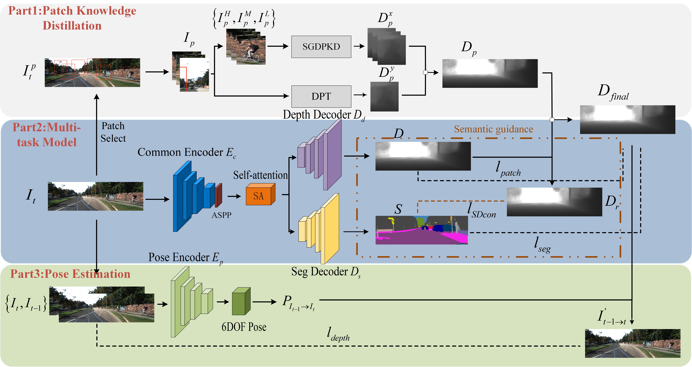
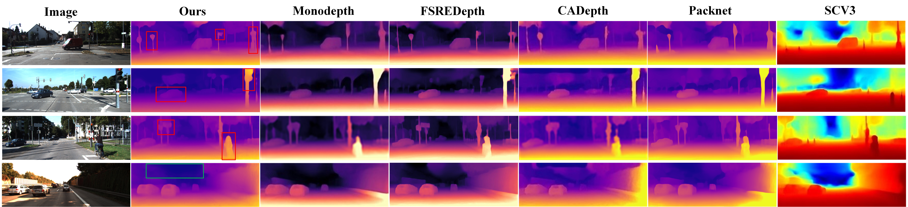

# **Semantic-Guided Monocular Depth Estimation Based on Patch Knowledge Distillation**

#### Jia Liu, Bin Wang, Shuai Ding， Lina Wei， Dapeng Chen and Yongze Li

## Introduction
This repository contains the implementation of the Semantic-Guided Monocular Depth Estimation model based on Patch Knowledge Distillation, developed by Bin Wang from Nanjing University of Information Science and Technology.

The model enhances depth estimation accuracy through explicit constraints from semantic segmentation, focusing on refining depth estimation contours.The model framework is shown in the figure:



The performance of the model on the Kitti dataset compared with other models is shown in the figure：



The model's performance on different datasets (Kitties, Cityscapes, Ddad, DIML, and Nyu) is shown in the figure:


### Results

| Method | Train | BackBone | Abs Rel | Sq Rel | RMSE | RMSE log |δ < 1.25 | δ² < 1.25 | δ³ < 1.25 | 
|--------|---------|---------|---------|---------|---------|---------|---------|---------|---------|
| Ours | M+Se |ResNet50|0.091|0.625|4.266|0.161|0.894|0.964|0.986|
| Ours(288x960) | M+Se|ResNet50|0.088|0.611|3.962|0.157|0.897|0.968|0.986 |
| Ours(384x1280) |M+Se|ResNet50|0.083|0.572|3.751|0.153|0.901|0.970|0.988|

## Modules

### 1. Semantic-Depth Consistency Loss
We devised a semantic-guided monocular depth estimation model based on patch knowledge distillation . This model incorporates a semantic depth consistency loss, ensuring that pixels with the same semantic label possess consistent relative depth.

### 2. Patch Knowledge Distillation Module
We improved the patch-based depth refinement method by employing dual networks (self+DPT) to estimate multi-scale patch depths. These patch depths are fused using contour masks. We incorporate this approach into model training, achieving patch-based knowledge distillation via the patch loss function.

### 3. Global-local Attention Mechanism
We introduced a global-local attention module in the decoder to enhance the extraction capability of deep features. 

## Requirements
- Python 3.9
- Dependencies listed in `requirements.txt`

## Dataset
This project uses the following datasets for training and testing of monocular depth estimation. The training datasets include KITTI and Cityscapes, while the testing datasets include DDAD, DIML/CVL, and the NYU Depth Dataset V2. Detailed descriptions of each dataset and their official website links are provided below.

Kitti：https://www.cvlibs.net/datasets/kitti/

Cityscapes：https://www.cityscapes-dataset.com/

DDAD：https://github.com/TRI-ML/DDAD

DIML/CVL：https://dimlrgbd.github.io/

NYU：https://cs.nyu.edu/~fergus/datasets/nyu_depth_v2.html

### Data Preprocessing for Kitti Dataset

The preprocessing of the Kitti dataset is an essential step to prepare the data for training and testing the monocular depth estimation model. This process is handled in the `/SGDEM-master-main/dataloader/data_preprocessing/` directory, which contains scripts and functions designed to load, augment, and normalize the Kitti data effectively.

## Installation Guide
To get started with this project, follow these steps to set up the environment on your system:
1. Verify Python Version
- This project requires Python 3.9. Check your installed version by running:

```bash
python --version
```

- If Python 3.9 is not installed, download it from the official Python website and install it.

2.Navigate to Project Directory

- Open a terminal and change to the project's root directory (where requirements.txt is located):

```bash
cd /path/to/project
```

3. Install Dependencies 
- Install all required Python packages listed in requirements.txt by running:

```bash
pip install -r requirements.txt
```

This command installs libraries such as PyTorch, NumPy, and others necessary for the project.

##  Usage Instructions
This section provides detailed instructions on how to use the code for Training, Testing, and Inference with the project. Each part includes specific steps and example commands to ensure users can run the code smoothly.

1.Training

- Navigate to the Project Directory: Ensure you are in the project's root directory where the training script is located.
- Run the Training Script: Use the following command to start the training process. Replace paths and parameters as needed:

```bash
python3 train.py \
        --model-name SGDEM \
        --depth-training-loaders "kitti_zhou_train" \
        --train-batches-per-epoch 7293 \
        --masking-enable \
        --masking-from-epoch 15 \
        --masking-linear-increase
```
You can check “./arguments.py” to see which specific parameters need to be selected and adjusted during code training.

2.Depth Evaluation

For evaluation of the predicted depth use eval_depth.py. 
```bash
python3 eval_depth.py\
        --sys-best-effort-determinism \
        --model-name "eval_kitti_depth" \
        --model-load sgdepth_eccv_test/zhou_full/checkpoints/epoch_20 \
        --depth-validation-loaders "kitti_zhou_test"
```

3.Segmentation Evaluation

For the evaluation of the segmentation results on Cityscapes use the eval_segmentation.py
```bash
python3 eval_segmentation.py \
        --sys-best-effort-determinism \
        --model-name "eval_kitti_seg" \
        --model-load sgdepth_eccv_test/zhou_full/checkpoints/epoch_20 \
        --segmentation-validation-loaders "cityscapes_validation" \ 
        --segmentation-validation-resize-width 1024 
        --segmentation-validation-resize-height 512 \
        --eval-num-images 1
```

4.Inference

The inference script is working independently. It just imports the model and the arguments. It inferences all images in a given directory and outputs them to defined directory.
```bash
python3 inference.py \       
                    --model-path sgdepth_eccv_test/zhou_full/epoch_20/model.pth \
                    --inference-resize-height 192 \
                    --inference-resize-width 640 \
                    --image-path /path/to/input/dir \
                    --output-path /path/to/output/dir
```
